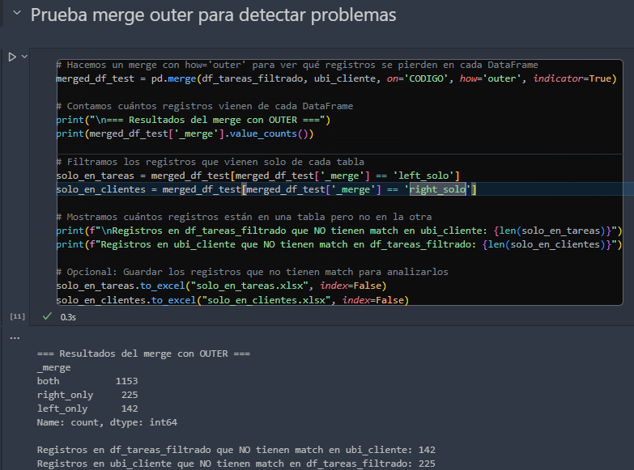

# Detalles de calidad de datos a tener en cuenta en un futuro:

---

# Merge:

Trabajando el archivo 03_merge_mapa.ipynb hice un descubrimiento y te paso toda la info para que decidamos que hacer.

Hice la  **prueba que te mando en la foto*

**(dejo la prueba pusheada en el notebook para que puedas observarlo) y dejo comentado el inner join para eliminarlo despues de que corrobores lo que te estoy compartiendo)**

***¡Confirmado! Estamos perdiendo datos con el **`<b data-stringify-type="bold">merge</b>` ** original (** `<b data-stringify-type="bold">inner</b>`**)**

 **¿Qué nos dicen estos resultados?**

* `both: 1153` → Son los registros que **sí** matchearon en ambos datasets. Estos son los únicos que quedan en el merge con `inner`.
* `left_only: 142` → **142 tareas** que están en `df_tareas_filtrado` **NO tienen un cliente asociado en `ubi_cliente`
* `right_only: 225` → **225 clientes** que están en `ubi_cliente` **NO tienen una tarea en **`df_tareas_filtrado`.

 **¿Qué significa esto en términos de pérdida de datos?**
 Con `how='inner'` **, estamos eliminando estos 367 registros (**`142 + 225` **) del dataset final** . **Si las tareas son lo más importante (y un cliente sin tarea no importa)** → **Usá `left`.
 **Si los clientes son lo más importante (y una tarea sin cliente no tiene sentido)** → Usá `right`
 **Si querés ver TODO lo que hay y después decidir cómo manejarlo** → **Usá **`outer`** y revisá los `NaN`

Si la pérdida de 225 clientes sin tareas  **no afecta el análisis** , usamos `left`.

Pero si afecta, usamos `outer` y tenemos que revisar cómo manejar los `NaN` en los datos.

 **Conclusión:**
El problema se origina en la forma en que se recogen y almacenan los datos. Aunque se pueden aplicar soluciones "parche" en el merge o en la visualización para no perder la pista de un camión, lo ideal es que se trabaje en la  **calidad y consistencia de los datos desde su origen** . Una vez asegurada esa consistencia, el merge funcionará correctamente y el mapa reflejará todos los camiones sin que haya huecos.

Opciones para Solucionar el Problema de los Merge

**Mejorar la captura de datos en el origen**

* **Pro:** Solucionás el problema de raíz (no más CODIGOs faltantes o inconsistentes).
* **Contra:** Requiere cambios en procesos y sistemas de la empresa (puede ser largo y costoso).

1. Implementar un Proceso de Detección y Reporte (ETL)

   * **Pro:** Usás un `outer join` (o uno “mixto”) para encontrar huérfanos y creás un **reporte** que diga: “Ojo, faltan X CODIGOs”.
   * **Contra:** No soluciona el origen, pero sí te da visibilidad y te permite avisarle a la empresa dónde está la falla.
2.  Agregar Filtros e Íconos Especiales en el Mapa (usamos outer join y en vez de que nos quede con NANS le ponemos "sin tarea o sin cliente" y le cambiamos el icono en el mapa del camion para que se note que tiene un problema)

* **Propuesta:**
  * **Filtro “sin cliente”(activado por defecto)** : Mostrar las TAREAS sin Ubicación con un ícono (ej. un camión fantasma ).
  * **Filtro “sin tarea”(activado por defecto)** : Mostrar Ubicaciones sin TAREAS con otro ícono (ej. un camión con signo de pregunta ).
  * Así, cuando el dueño vea el mapa, dirá “Ah, mirá, este camión aparece como ‘sin cliente’… tenemos que arreglar eso en la base”.
* **Pro:** No “desaparece” el camión; al contrario, lo destacás y lo usás como alarma visual.
* **Contra:** Si se acumulan muchos orfanitos, el mapa puede llenarse de íconos raros, y puede meter presión al equipo para arreglarlo.
* (Igual, eso podría ser bueno para que lo solucionen, no?).

---

# Ubicaciones

Aunque me pediste los cambio por llamada,luego me los confirmaste por slack en el canal de calidad de datos:


En la ultima llamada me dijiste que "no habia que actualizarlo" asi que por las dudas, te dejo guardados en el repositorio los archivos nuevos que me diste y el archivo de ubicaciones nuevos por si se te borran de slack el dia de mañana, junto al pdf "calidad de datos" donde te explicaba todos los detalles de este tema, tanto nombres de archivos como efectos.

PD: si surgen dudas nuevamente de este tema de ubicaciones, aclararlas revisando la información, te pase la evidencia de todo lo sucedido, links al historial de github, captura de pantallas, explicacion en pdf, todo clarisimo de que sucede si haces dichos cambios, en resumen, lo unico que tenes que entender, es que si aplicas el cambio que me pasaste se van a agregar datos que borrabamos, el porque sucederia esta explicado en detalle.

Despues, si decidis aplicar dicho cambio, vas a tener que cambiar el merge.py en el repositorio automatizable, donde haciamos la misma limpieza a ubicaciones, borrando las filas vacias de columna tareas (si no lo haces, se te va a borrar todo y vas a tener un problema ahi)(al igual que dependiendo lo que decidas hacer con el merge de los datos, cambiar tambien el merge en el .py)

---

# Otras mejoras que fuimos detectando en el tiempo:

## Mejora 1 (para automatizacion): **Un sistema que transforme la salida de consola de GitHub Actions en un dashboard visual que muestre el proceso ETL de Bisturito-autoSafe.**

🔄 El flujo sería así:

### 1. Disparador

* El workflow principal ejecuta los 3 scripts
* Cada script usa `Tee-Object` para guardar su salida
* Los logs se almacenan como artifacts

### 2. Recolección de Datos

El sistema captura de cada etapa:

**Etapa 1 - Safetrack Unificado:**

* Archivos "Reporte de viaje" procesados
* Cantidad de bloques detectados por archivo
* Filas procesadas en cada bloque
* Tiempo de procesamiento

**Etapa 2 - Merge:**

* Estado de unificación de datos
* Validaciones de coordenadas realizadas
* Errores de geocodificación
* Tiempo de merge

**Etapa 3 - Subida a Sheet:**

* Estado de conexión con Google
* Confirmación de carga
* Tiempo total de subida

### 3. Generación del Reporte

Transforma los datos en:

**Panel Principal:**

* Timeline completo del proceso
* Estado general (✅ o ❌)
* Métricas clave:
  * Total archivos procesados
  * Total registros
  * Tiempo total
  * Tasa de éxito

**Secciones Detalladas:**

* Distribución de bloques
* Métricas de calidad
* Puntos de atención

### 4. Publicación

* Se genera página HTML en gh-pages
* Dashboard accesible vía URL privada
* Notificación automática con link

## 🎯 Beneficios

* **Monitoreo Real** : Ver el proceso completo en un vistazo
* **Detección Temprana** : Identificar problemas por etapa
* **Histórico** : Comparar ejecuciones anteriores
* **Colaboración** : Todo el equipo ve el mismo estado

## 📊 Ejemplo de uso diario:

1. **Mañana - 12:41:00**
   * Inicia pipeline
   * Se procesan ~15 archivos
   * ~60 bloques totales
   * ~2,800 registros
2. **Finalización - 12:50:19**
   * Dashboard muestra:
     * ✅ Proceso completo
     * 9m 19s duración total
     * Desglose por etapa
     * Alertas (si hubiera)
3. **Métricas Destacadas**
   * Tiempo por etapa
   * Distribución de datos
   * Calidad de geocodificación
   * Estado de Google Sheets
4. **Alertas Específicas**
   * Bloques anómalos
   * Errores de coordenadas
   * Problemas de conexión
   * Variaciones significativas

Todo esto basado en los logs reales que vimos, manteniendo la privacidad de los datos sensibles pero mostrando las métricas importantes para el seguimiento del proceso.

---

# 🚀 Otras ideas de futuras Mejoras

* Asignacion de camiones a clientes: Los camiones no tienen en cuenta las "casas" de los conductores, entonces intenta asignar a traves de la prediccion al cliente mas cercano, resultando en un sesgo, por ejemplo un camion cerca de "Casa Martin" se le asigna el cliente mas cercano aunque solo este en "casa martin" descansando, eso afecta tambien a la estadistica.
* Contadores para los datos que se esten filtrando ( Proyectos_CAMIONE / Proyectos_CLIENTES)
* Recortes criterio demora de camiones para algunos outliers que quedaron.(excluir zona empresa)
* Idea: Hacer una pantalla de carga, donde precalculemos todo lo posible al iniciar, ahorrando el tiempo luego de esos calculos, necesario para que la app luego funcione rapidamente. Incluso podria haber una leyenda que diga "Calculando x cosa... calculando x otra..."
* Distancia en metros entre camion y clientes
* **Rendimiento de la app:**

  * Optimiza el rendimiento si trabajas con grandes volúmenes de datos, por ejemplo, utilizando técnicas de paginación o agrupación o de cacheo.
  * Que cosas se pueden precalcular para optimizar la aplicación
  * Hacer módulos para facilitar lectura y mantenimiento.

Nota de mara: Interesante e importante ver el tema del rendimiento para grandes volúmenes.- Lo tenemos en cabeza, otra también el histórico guardar.- Voy a consultar pero se puede dejar solo un mes para atras y los otros elliminarlos.- Alguna funcion para que tenga un tope de 90 días o 120 días puede ser.- Voy a verlo con la empresa

- **Visualización de Rutas de Camiones**

  - Implementar trazado de rutas para cada camión
  - Agregar control para mostrar/ocultar rutas
  - Colorear rutas según el camión
  - Agregar animación del recorrido
  - Implementar flechas direccionales
  - Agregar estadísticas de recorrido (distancia, tiempo, paradas)

Detalles de implementación:

```r
# Requerirá:
library(leaflet)
library(leaflet.extras)  # Para animaciones

# Principales funciones a utilizar:
# - addPolylines() para trazar rutas
# - addArrows() para dirección
# - addPlayback() para animación

```


---

---

Informacion a tener en cuenta
